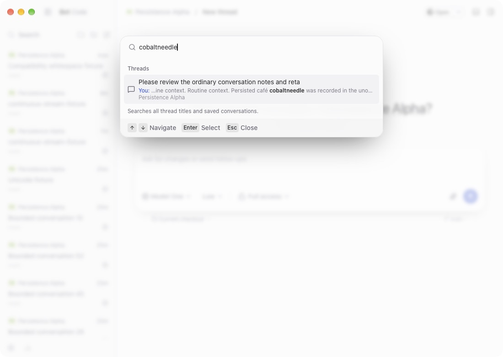

# Persisted conversation search verification

Verified in actual macOS Tauri on 2026-10-08. The behavior reference was T3 Code v0.0.45 at `6c8fed35d`.

## Behavior

Command+K searches saved prompts, steering user input and assistant messages across projects. It returns one excerpt per matching conversation, including conversations never opened during the current session. Archived conversations stay excluded. Snoozed and settled conversations remain searchable.

Exact titles, title prefixes and other title matches retain their existing order before message matches. Actions remain available, and `>` selects action search. Enter opens the existing project and conversation route, as in the reference behavior.

Message queries require 2–200 Unicode scalars and debounce for 200 ms. Results contain at most 50 message-only conversations and 240-scalar excerpts, including ellipses. The palette reports overflow, loading and retryable errors. Query changes discard previous-query rows. Revision and workspace invalidations suppress obsolete rows while unrelated streaming changes allow search to finish.

The native worker scans saved SQLite snapshots through a read-only connection outside the runtime owner. The output is bounded; scan work remains linear in saved history. Streaming text becomes searchable after its ordinary persistence save. No search index, schema migration or frontend history preload is added.

## Native restart proof

The verification used two disposable Git repositories and `BOT_CODE_DATA_DIR=/tmp/botcode-persisted-search/data`. `BOT_CODE_CODEX_BIN` pointed to a disposable copy of the repository's fake Codex provider. The fixture repository commits contain only verification data.

1. Sent a message through the actual composer. Its body contained `Persisted café cobaltneedle was recorded in the unopened conversation.` Its title did not contain `cobaltneedle`.
2. Created a second conversation, quit the app and restarted it. The app opened a new-thread draft with no conversation selected.
3. Opened Command+K and searched `cobaltneedle` before opening any saved conversation. The original build returned no results. The corrected build returned the saved conversation with its excerpt and `Persistence Alpha` project label.
4. Pressed Enter. The app selected workspace `3f3c50cc-eaaa-4d98-a3f9-4fa90d6fb648` and thread `6fa69fab-5bb2-4929-b1c4-f1286af4e42d` and displayed the persisted conversation.

The retained screenshots show [the baseline failure](verification/persisted-message-search/baseline.jpg), [the corrected unopened result](verification/persisted-message-search/restart-match.jpg), and [the minimum-size window](verification/persisted-message-search/minimum-window.jpg). The recorded native output shows [the fresh draft before search](verification/persisted-message-search/restart-before.txt) and [the selected conversation](verification/persisted-message-search/selection.txt). The text files contain the original tool output, extracted after the audit found that saved accessibility diffs omitted the state details.

To repeat the core proof, start Tauri with a fresh `BOT_CODE_DATA_DIR`, open a disposable repository, and send a prompt with an ordinary title prefix followed by a distinctive sentinel. Quit and restart with the same environment. Search the sentinel before selecting any saved conversation. The repository's `crates/bot-core/tests/support/codex_peer.py` can supply deterministic provider replies through `BOT_CODE_CODEX_BIN`.

During post-quit accessibility inspection, the computer-use tool inadvertently relaunched an interim test bundle without its isolated environment. It opened the default database with writable handles. That instance received no deliberate UI interaction and was stopped after detection. Default-data immutability was not established. The corrected search checks were separately bound to instances whose database handles pointed to the isolated directory.

## Additional checks

| Check                           | Observed result                                                                                      |
| ------------------------------- | ---------------------------------------------------------------------------------------------------- |
| Cross-project message and Enter | Opened the Beta project and matching thread                                                          |
| Action and title ranking        | Actions work; exact, prefix and other titles precede message results                                 |
| Archive and shelves             | Archived sentinel absent; snoozed and settled sentinels present                                      |
| Assistant messages              | Agent excerpt returned                                                                               |
| Result limit                    | 50 rows and a refine-search hint for 55 matching conversations                                       |
| Unicode offsets                 | Correct snippet and highlight after 300 compatibility whitespace characters                          |
| Late Unicode match              | Excerpt contains the matching text after a long emoji and compatibility-text prefix                  |
| Rapid query replacement         | No obsolete message row after replacing the query with an archived-only sentinel                     |
| Native failure and Retry        | Explicit failure retains title results; Retry restores the message result after database restoration |
| Continuous streaming            | Persisted result found while another turn's saved execution was still running                        |
| Native layout                   | Palette fits at 1100×780 and at the 1000×620 minimum; restart search works at both sizes             |

Controller tests use mock timers and deferred requests to verify loading, stale successes and errors, revision filtering, workspace deletion, retry, and progress during repeated invalidations. The native suite covers cold-runtime persistence, archive/restore, rewind/deletion/project removal, title exclusion before the cap, normalization and grapheme-safe excerpt bounds.

The final source passed 433 UI tests, 410 Rust tests, the Tauri debug build including TypeScript checking, Prettier, `cargo fmt`, and workspace clippy with warnings denied. Logs are `corrected-ui.log`, `corrected-core.log`, `corrected-build.log`, `corrected-format.log`, `corrected-rust-format.log` and `corrected-clippy.log` in the evidence directory. The independent source review passed. Supplemental captures and logs remain local under `/tmp/botcode-persisted-search/evidence`; the review report is `/tmp/botcode-persisted-search/final-review.md`.
